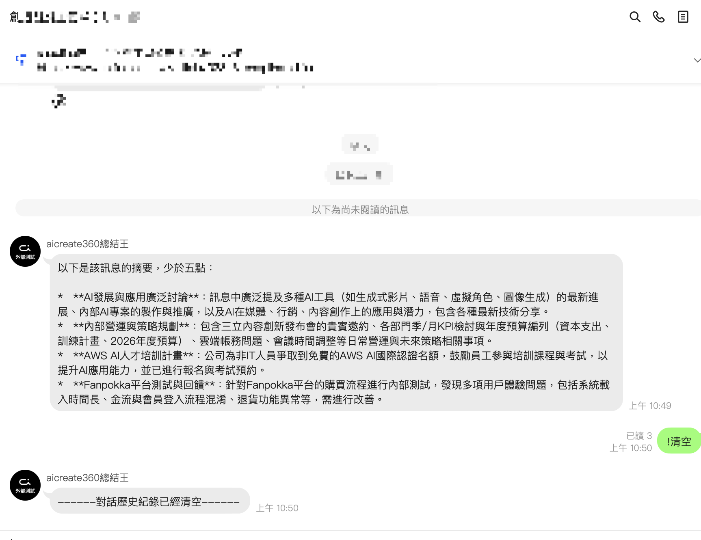
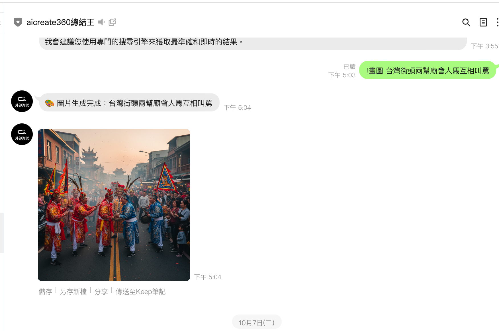

# POC: LINE 對話摘要助手

## 概述
提供自動化 LINE 對話摘要服務，協助團隊快速掌握群組與客戶溝通重點，減少人工整理時間。

## 使用方法
1. 加入 LINE 官方帳號並完成企業或社群的對話綁定。
2. 在需要彙整的對話中 @ 助手或轉傳訊息給助手。
3. 選擇摘要範圍（例如當日、指定時段或關鍵字）。
4. 收到重點摘要、待辦清單與建議回覆，並可直接分享給團隊。
5. 登入管理後台，下載歷史報告或匯出 Excel 方便後續追蹤。

## 主要功能
- **重點摘要**：自動整理冗長對話成 3-5 個可行動重點。
- **待辦整理**：從訊息中提取待辦項目與負責人。
- **關鍵字提醒**：即時通知特定關鍵字或敏感訊息。
- **報表匯出**：提供每日、每週、每月報告，支援 Excel 與 PDF 格式。

## 應用場景
- 公司內部 LINE 群組的專案與會議紀錄管理。
- 客戶服務、業務諮詢或售後維運的對話整理。
- 活動或課程群組，提供參與者事後重點摘要。

## 相關資源
- **體驗申請**：洽業務窗口預約 Demo。
- **使用指引**：內部文件提供上線流程與最佳實務。

## 成本效益
- 縮短人工整理時間，讓客服與專案人員專注於回應客戶。
- 提升決策效率，管理層可以快速掌握對話脈絡。
- 降低資訊落差，確保關鍵待辦不被忽略。

## 狀態
- 標籤：LINE, 摘要, 客服, 生產力工具

## 備註
- 支援繁體中文介面，可依服務等級調整摘要頻率與通知設定。
- 可與 CRM 或工單系統串聯，細節視實際方案調整。

