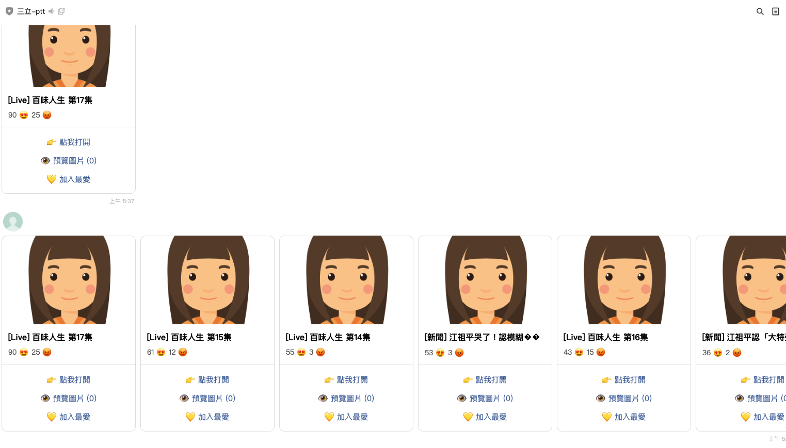

# POC: LINE Bot PTT 三立討論閱讀器

## 概述
提供透過 LINE Bot 閱讀 PTT 三立討論版文章的服務，協助新聞與社群團隊快速掌握最新討論動向，減少手動翻頁搜尋的時間。

https://line.me/ti/p/@153kdpxr

## 使用方法
1. 將 LINE Bot 加入好友或邀請至群組，完成權限授權。
2. 輸入關鍵字或日期區間，請求最新的 PTT 三立討論文章。
3. 選擇想閱讀的文章編號，立即取得標題、推文摘要與關鍵留言。
4. 可將文章摘要轉寄給其他成員，或標記為收藏以利後續追蹤。
5. 透過每日通知設定，自動接收熱門討論整理。

## 主要功能
- **文章快覽**：一次取得多篇 PTT 三立討論文章的標題與重點。
- **留言精選**：彙整熱門推文與反向意見，協助判斷輿情走向。
- **關鍵字追蹤**：當指定關鍵字出現於最新文章時即時通知。
- **收藏與分享**：支援收藏清單與 LINE 內分享，方便團隊協作。

## 應用場景
- 新聞編輯室每日彙整 PTT 三立討論版熱門話題。
- 品牌與行銷團隊追蹤相關議題聲量與消費者回饋。
- 客服或公關人員監控潛在危機訊號，提前準備回應。

## 成本效益
- 自動化蒐集與整理討論文章，節省人工瀏覽時間。
- 即時掌握輿情脈動，縮短決策與回應時間。
- 透過 LINE 渠道提供資訊，降低使用門檻並提升協作效率。

## 狀態
- 標籤：LINE Bot, 輿情監控, 新聞追蹤, 社群分析

## 備註
- 彙整內容僅供內部參考，實際回應仍需人工判讀與確認。
- 關鍵字通知與報表頻率可依需求調整。

