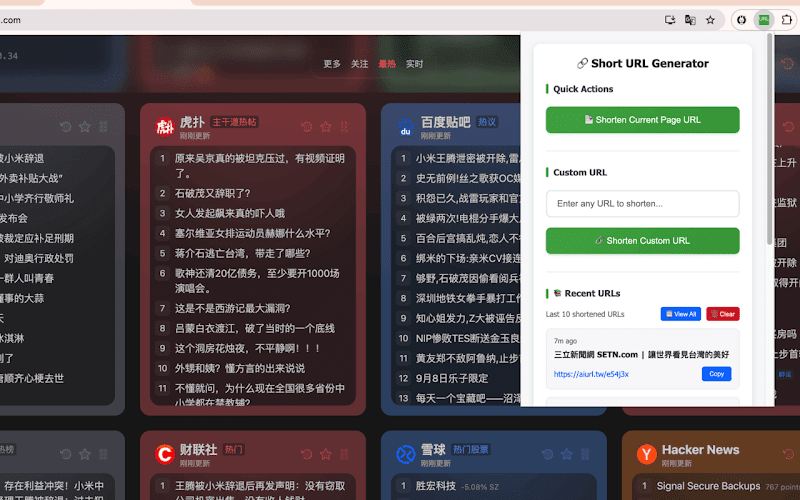

# POC: Short URL Extension (Chrome 擴充功能)

## 概述
提供以 CF Worker API 為後端的 Chrome 縮網址擴充功能，協助行銷與內容創作者快速生成可自訂的短網址，提升分享效率並集中管理歷史紀錄。

## 使用方法
1. 從 Chrome 線上應用程式商店安裝 Short URL Extension。
2. 點擊擴充功能圖示，即可選擇縮短目前頁面網址或輸入自訂網址。
3. 按下「Shorten」後，系統會透過 CF Worker API 生成短網址並自動複製到剪貼簿。
4. 於歷史紀錄列表查看、複製或刪除已建立的短網址紀錄。
5. 如需自訂短網址路徑，可在生成前輸入自訂識別字串。

## 主要功能
- **一鍵縮址**：快速將當前頁面或自訂網址縮短。
- **自訂路徑**：可輸入自訂短網址識別碼，維持品牌一致性。
- **自動複製**：生成後立即複製短網址，方便貼上分享。
- **歷史紀錄**：保留縮址歷程，可隨時回查或管理。

## 應用場景
- 社群小編或行銷人員需快速產出短網址做活動宣傳。
- 內部團隊分享多個長網址，希望統一管理與追蹤。
- 客服或業務團隊為客戶建立專屬短網址便於溝通。

## 相關資源
- **Chrome 擴充功能頁面**：https://chromewebstore.google.com/detail/short-url-extension-333/cpgihhghfphpbapipfllmlplmfokfhaj
- **CF Worker API**：後端縮址服務

## 成本效益
- 大幅縮短處理網址的時間，提升分享效率。
- 自訂路徑強化品牌記憶，提升點擊率。
- 歷史紀錄集中管理，降低重複建立與遺漏風險。

## 狀態
- 標籤：Chrome Extension, 縮網址, 行銷工具

## 備註
- 本擴充功能僅限縮短網址用途，不提供額外分析或統計功能。
- API 服務穩定性與資安需依企業部署策略評估。
